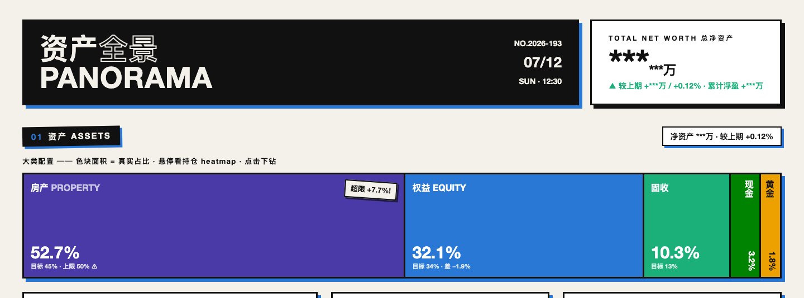
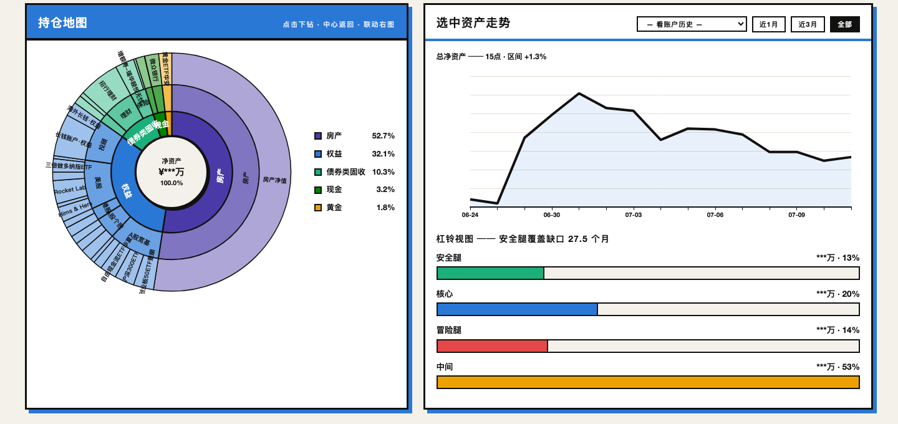
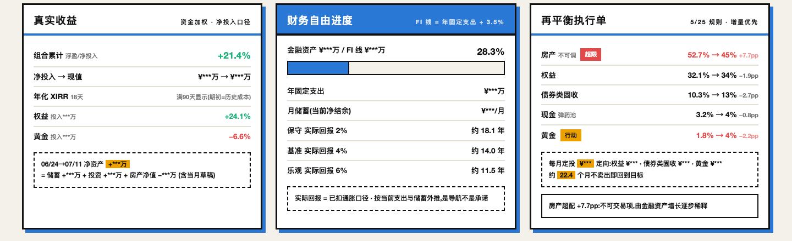
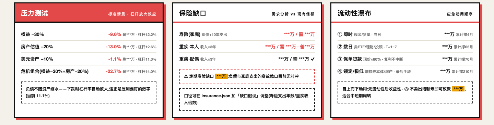
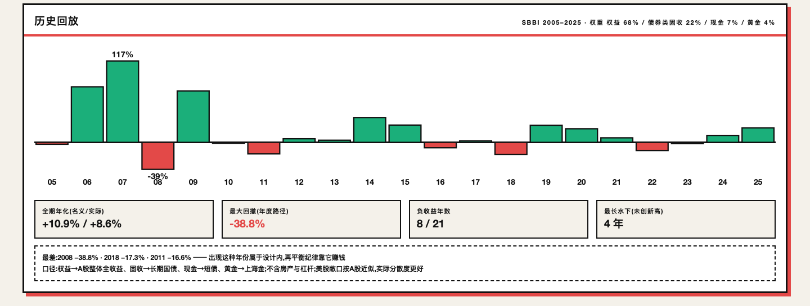

# 资产组合每日实时估值

> 自包含项目文件夹。所有脚本以「脚本所在目录」为基准读写同层的数据/配置/输出文件，
> 因此**代码与数据需保持同层**（请勿把 .py 与 .csv/.json 拆到不同子目录）。

## 功能一览

零依赖(纯 Python 标准库 + 单文件 HTML 产物)的个人资产管理系统：实时估值、现金流、订阅/保险/负债台账、投顾级指标与纪律审计。以下截图来自「色块海报」主题，**演示脱敏模式**开启（页脚 👓 按钮，一键把所有绝对金额替换为 `***`，百分比与结构保留）。

**总览与大类配置**——净资产 HERO、日变动、大类配置色块（面积=真实占比，悬停看持仓 heatmap，点击 FLIP 下钻）：



**持仓地图与走势联动**——旭日图三层下钻（大类→子类→持仓），点击任意节点右侧联动该资产走势，中心返回并切回总资产曲线；杠铃视图衡量安全腿覆盖：



**投顾三卡**——真实收益（资金加权 XIRR + 净资产增长归因：储蓄/投资/房产三块精确闭合）、财务自由进度（FI 线 + 三情景实际回报推演）、再平衡执行单（5/25 规则 + 每月定投定向金额，不卖出优先）：



**风险三卡**——压力测试（标准情景冲击后的净资产与杠杆）、保险缺口（需求分析 vs 现有保额）、流动性瀑布（应急动用顺序，含保单贷款梯队）：



**SBBI 历史回放**——当前配置权重穿越 2005–2025（数据源：有知有行《中国资产分类投资年鉴》附录，转录经年化校验测试锁定）；一眼看清"正常波动"的范围：



另有三个独立产物：`ips.html` 投资政策声明（目标配置/容忍带/定投规则/集中度红线 + 每笔台账操作的自动合规审计）、`report_<年>.html` 年度报告（归因/收益/月账/大事记/回放，一月自动生成上一年）、`panorama_terminal.html` 交易终端暗色主题。

## 目录结构

```
asset-panorama/
├── 引擎与视图（代码）
│   ├── portfolio_tracker.py   估值引擎 + 唯一历史记录者（腾讯/新浪双源行情、健康检查/备份）
│   ├── panorama_data.py       共享数据层 collect()（行情/汇率/K线/现金流/订阅/保险/历史）
│   ├── panorama_themes.py     全景渲染（经典配色，ECharts）→ panorama_origin.html
│   ├── panorama_variants.py   全景渲染（数据驱动模板，零依赖）→ panorama_terminal.html / panorama_poster.html
│   ├── rebuild_views.py       轻量重渲染（一次取数渲三产物，K线只用缓存）——各 Tab「保存并刷新」走这里，数秒
│   ├── cashflow_editor.py     本地 Web 应用：全景/现金流/订阅/对账/保险/负债/持仓管理 七 Tab（:8765）
│   │                          「保存并刷新」=轻量重渲染；右上「↻ 重新估值」=完整 run_daily（拉行情+历史+通知+备份）
│   │                          选「色块海报」主题时整个面板（壳+管理页）跟随粗野主义皮肤（cookie skin=poster）
│   ├── cashflow_income.py     收入明细 → 当月实发（薪酬计税 / 固定比例 / 公积金到账）
│   ├── payroll_tax.py         北京五险一金 + 个税累计预扣 + 公积金到账估算
│   ├── subscriptions.py       订阅台账、月历、续费提醒、图标缓存、fixed_out 唯一聚合点
│   ├── insurance.py           保险保单台账、保费摊月、缴费提醒
│   ├── bill_import.py         微信/支付宝/银行账单 CSV 解析与月度汇总
│   ├── cashflow_history.py    现金流月度历史（草稿 upsert + 对账确认锁定）
│   └── update_values.py       半自动更新无 API 账户（CLI 备用；日常用面板「持仓管理」Tab）
├── 配置/数据（与代码同层，个人数据不入库）
│   ├── holdings.csv           可实时报价证券
│   ├── accounts.csv           固定/半自动账户
│   ├── manual_values.json     无 API 账户最新值
│   ├── passthrough.json       长钱/海外长钱 穿透权重
│   ├── cashflow.json          收入明细、月度收支、薪酬计税、定投计划
│   ├── subscriptions.json     订阅台账（域名、周期、分类）
│   ├── insurance.json         保障型保单台账（险种、保额、年缴、缴费日）
│   └── insurance_cashvalue.csv 增额寿现金价值表
├── 自动生成的状态/产出
│   ├── history.csv(.bak)      每日大类净值历史
│   ├── cashflow_history.csv   每月现金流汇总历史
│   ├── quotes_cache.json      行情缓存（双源回退）
│   ├── icons_cache/           订阅 favicon 本地缓存
│   └── panorama_*.html        各视图产物（origin/terminal/poster 三套主题）
├── run_daily.sh + com.user.portfolio.plist  每日定时
└── docs/                      功能规格与参考文档
```

## 快速开始

首次克隆后，从 `*.example` 复制个人配置（仓库不含真实持仓/账户数据）：

```bash
cp holdings.csv.example holdings.csv
cp accounts.csv.example accounts.csv
cp manual_values.json.example manual_values.json
cp passthrough.json.example passthrough.json
cp cashflow.json.example cashflow.json
cp subscriptions.json.example subscriptions.json
cp insurance.json.example insurance.json
# 如有增额寿：cp insurance_cashvalue.csv.example insurance_cashvalue.csv
```

```bash
python3 cashflow_editor.py       # ⭐ 本地面板（全景/现金流/订阅/对账/保险/负债/持仓管理）→ http://127.0.0.1:8765
python3 panorama_themes.py       # 🎨 全景渲染（经典配色） → panorama_origin.html
python3 panorama_variants.py     # 🎨 全景渲染（交易终端/色块海报） → panorama_terminal.html / panorama_poster.html
python3 portfolio_tracker.py       # 终端估值 + 历史记录 + 再平衡告警
python3 update_values.py           # 更新投顾/理财/存款/房产等手动账户
bash run_daily.sh                  # 一键估值 + 重渲染全景 + 缴费提醒通知
bash run_tests.sh                  # 全模块自测（改动后跑一遍防回归）
```

### 本地资产面板 `cashflow_editor.py`

浏览器打开 **http://127.0.0.1:8765**，顶部标签切换：

| Tab | 功能 |
|---|---|
| 持仓全景 | 嵌入 `panorama_*.html`，可切换经典配色/交易终端/色块海报 3 套主题，一键「重新估值」 |
| 现金流编辑 | 收入明细、月度支出、定投计划；保存写回 `cashflow.json` |
| 订阅管理 | 增删改订阅、域名拉图标、保存写回 `subscriptions.json` |
| 月度对账 | 账单导入 + 确认真实收支，锁定 `cashflow_history.csv` |
| 保险 | 保单台账增删改，保存写回 `insurance.json` |
| 负债 | 贷款台账（余额自动推演、利息月耗）+ 留尾测算器 |
| 持仓管理 | 持仓数量/新增/删除（自动联动 `holdings_history` 记买卖，成本口径不跑偏）+ 手动账户金额更新（写 `manual_values` 盖日期戳，替代 `update_values.py` 日常使用） |

### 月度对账 & 账单导入

- 自动跑只写入**草稿**（`已对账=否`，其他实际支出=0）；已对账月份**不会被覆盖**
- **账单导入**：上传微信/支付宝/银行导出的 CSV（可多选），自动识别编码与表头、剔除退款/不计收支/排除词（转账/还款/理财等资金腾挪），按月汇总一键填入「其他实际支出」
  - ⚠ 钱包绑银行卡时同一笔会在钱包账单和银行流水各出现一次，只导其一
- 确认后锁定该月；补账历史月使用该月草稿定格的固定支出口径
- 全景「现金流月度走势」：✅已对账实心柱 / ⏳草稿空心柱

### 保险台账

- 保单字段：成员/产品/险种/保额/年缴保费/下次缴费日/缴费年限/状态
- `状态=缴费中` 的年缴保费自动摊月并入固定支出（影响净结余与定投额）
- **缴费年限 0 = 续保型**（一年期医疗/意外），永续摊月
- 缴费日前 30/7/1 天面板告警；增额寿现金价值走资产口径，录入时状态设「已缴清」仅作台账

### 收入与薪酬计税

- **收入明细**填税前金额；类型选「工资」走北京五险一金 + **个税累计预扣**（计税月份自动跟当前自然月）
- 类型选「其他」用固定税后比例（奖金/劳务等）
- 可配置：公积金比例、本人/配偶专项附加扣除
- **公积金计入收入**（仅当可自由取出时开启）：每条工资自动追加「公积金到账 = 个人 + 单位」收入行（北京单位比例=个人比例），计入可支配收入与定投
- 全景与定投额按**当月预计实发**计入现金流

### 订阅管理

- 台账：名称、金额、币种、周期、下次扣费日、分类
- 年/季/周付自动折算月费，并入 `fixed_out`（固定支出）
- 月历 + 7/3/1 天续费提醒进面板告警
- **图标**：填域名自动拉 favicon 缓存（DuckDuckGo → Google）；失败回退分类 emoji
  - 例：`music.apple.com`（Apple Music）、`claude.ai`（Claude）、`apple.com`（iCloud）
  - 名称关键词兜底见 `subscriptions.py` 的 `KNOWN_DOMAINS`

### 全景面板：三套主题

- `panorama_origin.html`（经典配色·ECharts·联网）：大类/地域/币种、杠铃视图、现金流与储蓄率、订阅汇总与扣费月历、保险保障、现金流月度走势、再平衡告警等，图表最全。
- `panorama_terminal.html`（交易终端·零依赖·离线）：深色高密度终端风，状态条/净值面积图/大类配置/持仓 TOP12/地域币种/杠杆流动性/告警，一屏总览。
- `panorama_poster.html`（色块海报·零依赖·离线）：新粗野主义海报风，比例色块大类配置、14日粗线走势、持仓排行 TOP8、权益地域、警戒带。
- 后两者由 `panorama_variants.py` 以 `templates/terminal.html` / `templates/poster.html` 为基底、注入 `panorama_data.collect()` 的真实数据渲染，纯字符串替换、不联网、不依赖第三方库。

## 脚本说明

| 脚本 | 作用 |
|---|---|
| `cashflow_editor.py` | 本地 HTTP 服务：全景/现金流/订阅/对账/保险/负债/持仓管理 七 Tab |
| `panorama_variants.py` | 数据驱动全景模板渲染：`templates/*.html` 占位符替换 → `panorama_terminal.html` / `panorama_poster.html` |
| `payroll_tax.py` | 北京社保公积金个人扣缴 + 累计预扣个税 + 公积金到账 |
| `cashflow_income.py` | 收入明细统一出口（实发、扣缴明细、公积金行） |
| `subscriptions.py` | 订阅月度归一、日历、提醒、favicon 缓存；`cashflow_fixed_out` 为固定支出唯一聚合点 |
| `insurance.py` | 保单台账、保费摊月、缴费日滚动与提醒 |
| `loans.py` | 负债台账：余额按月推演、利息月耗、留尾测算（`python3 loans.py tail 月供 利率%`）。**净资产的负债即取自台账推演值**，`accounts.csv` 不再放负债行 |
| `bill_import.py` | 账单 CSV 嗅探解析（微信/支付宝/银行）与月度消费汇总 |
| `cashflow_history.py` | 月度现金流草稿 upsert + 对账确认锁定 |
| `storage.py` | 统一存储层：file/sqlite 二选一后端 + 迁移 CLI |
| `panorama_data.py` | `collect()`：估值 + 现金流 + 订阅 + 保险 + 历史，供渲染 |
| `portfolio_tracker.py` | 估值引擎、双源行情、写 `history.csv`、告警 |
| `notify_alerts.py` | 缴费/扣费到期日 macOS 系统通知（run_daily 末尾触发） |
| `run_daily.sh` | 一键跑「估值 + 全景 + 通知」，日志进 `run.log`（自动轮转） |
| `run_tests.sh` | 串跑各模块自测 |

## 数据/配置文件

| 文件 | 内容 |
|---|---|
| `cashflow.json` | 收入明细（税前）、`薪酬计税`（含公积金计入收入开关）、月度收支、定投、收益率假设 |
| `subscriptions.json` | 订阅列表（含可选 `域名` 字段） |
| `insurance.json` | 保障型保单台账 |
| `holdings.csv` | 可实时报价证券 |
| `accounts.csv` | 固定/半自动账户 |
| `manual_values.json` | 无 API 账户最新值 |
| `passthrough.json` | 长钱/海外长钱穿透权重 |

个人配置与运行时产出见 `.gitignore`（含 `cashflow.json`、`subscriptions.json`、`icons_cache/` 等）。

## 存储后端（file / sqlite 二选一）

所有数据集统一经 `storage.py` 读写，后端由 `storage.json` 配置（缺省 `file`）：

- **file（默认）**：现状不变——JSON/CSV 文件 + `.bak` 双备份，可直接手工编辑。
- **sqlite**：全部数据存进单文件 `panorama.db`（标准库 sqlite3），写入走事务（原子），
  上一版自动存 `docs_bak`/`tables_bak` 表；两后端对代码完全等价（`tests.py` 有等价性不变量测试）。

```bash
python3 storage.py status      # 当前后端 + 15 个数据集概况
python3 storage.py to-sqlite   # 文件 → panorama.db，并切换后端
python3 storage.py to-file     # 数据库 → 文件，并切换后端
python3 storage.py push 数据集  # sqlite 模式下导出单个数据集为文件（手工编辑用）
python3 storage.py pull 数据集  # 编辑完拉回数据库
```

⚠️ 两后端**不自动同步**：切换即一次全量拷贝，之后另一侧是冻结快照。
sqlite 模式下手工改 CSV/JSON 文件不会生效——先 `push`、改完 `pull`。

## 每日自动运行（macOS launchd）

```bash
cp com.user.portfolio.plist ~/Library/LaunchAgents/
launchctl load ~/Library/LaunchAgents/com.user.portfolio.plist   # 每个工作日 16:30
launchctl start com.user.portfolio                                # 立即测试
```

## 再平衡告警规则（可在 portfolio_tracker.py 顶部改）

- 大类越界：房产 >50%、权益 <25%、黄金 <3%、现金 >10%
- 偏离目标 >5% → 提示再平衡
- 单只个股 >10% 净资产；个股+杠杆 >20% 权益
- 持有杠杆 ETF → 提示了结
- 订阅续费 7/3/1 天前提醒；保险缴费 30/7/1 天前提醒（到期日弹 macOS 系统通知）

## 数据源

- **行情**：新浪主 + 腾讯备，`quotes_cache.json` 缓存
- **汇率**：`open.er-api.com`（失败回退 `FX_FALLBACK`）
- **K 线**：东财（国内本机）
- **订阅图标**：DuckDuckGo / Google favicon API

## 文档

| 文件 | 说明 |
|---|---|
| `docs/subscription-feature-plan.md` | 订阅管理功能规格（已实现） |
| `docs/cashflow-reconciliation-feature-plan.md` | 月度对账功能规格（已实现） |
| `docs/portfolio-snapshot.md` | 配置快照（本地，不入库） |

零第三方 Python 依赖（Python 3.8+）。ECharts 主题需联网加载 CDN。
